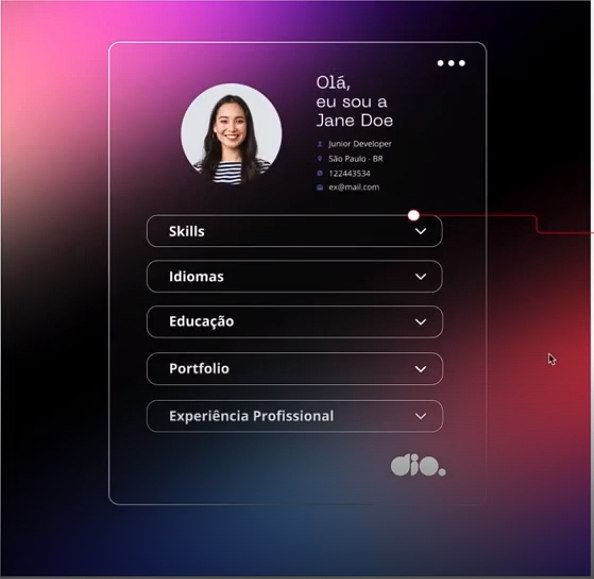

<h1 align="center">Currículo Online</h1>

Projeto de um currículo online, contendo skills, idiomas, experiências profissionais e link úteis para portfólio.  

  <a href="#-tecnologias">Tecnologias</a>&nbsp;&nbsp;&nbsp;|&nbsp;&nbsp;&nbsp;
  <a href="#-projeto">Projeto</a>&nbsp;&nbsp;&nbsp;|&nbsp;&nbsp;&nbsp;
  <a href="#-layout">Layout</a>&nbsp;&nbsp;&nbsp;|&nbsp;&nbsp;&nbsp;
  <a href="#-aprendizado">Aprendizado</a>&nbsp;&nbsp;&nbsp;|&nbsp;&nbsp;&nbsp;
  <a href="#memo-licença">Licença</a>

  

 

  

## 🚀 Tecnologias

Esse projeto foi desenvolvido com as seguintes tecnologias:

- HTML e CSS
- JavaScript
- Git e Github

## 💻 Projeto

O Projeto do currículo online agrega habilidades, idiomas, experiências profissionais, além de links úteis para mostrar o portfólio.

<!--[Acesse o projeto finalizado, online](https://Gustavo-Zamai.github.io/dev_links)-->
<!--
- [Assistir aulas](https://lp.rocketseat.com.br/devlinks/inscricao?utm_source=github&utm_medium=descricao&utm_campaign=capture-devlinks&utm_term=organic&utm_content=descricao-github-mayk-brito)
-->
<!--## 🔖 Layout

Você pode visualizar o layout do projeto através [Desse Link](https://www.figma.com/community/file/1187422022288947321). É necessário ter conta no [Figma](https://figma.com) para acessá-lo.

-->
---
## 📑 Aprendizado

Durante esse projeto, reforcei conceitos básicos de HTML, CSS e Javascript. E utilizei para fixar e melhor compreender sobre o alinhamento e posicionamento dos elementos em diferentes displays. 

---

## 📝 Licença

Esse projeto está sob a licença MIT.

---

Feito com ♥ por Gustavo Zamai
